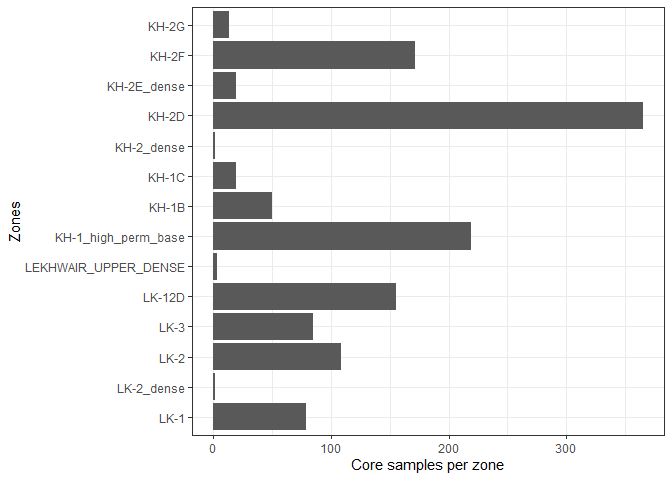
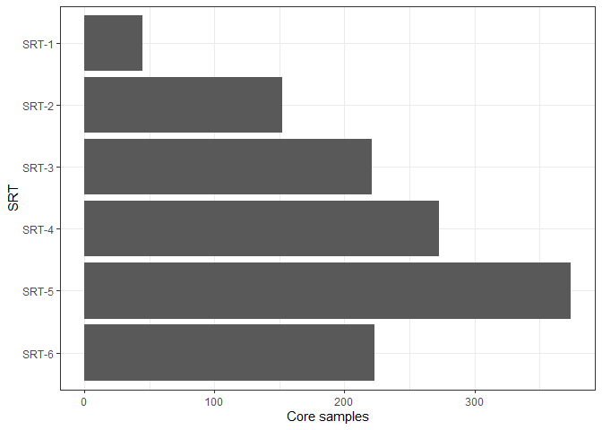
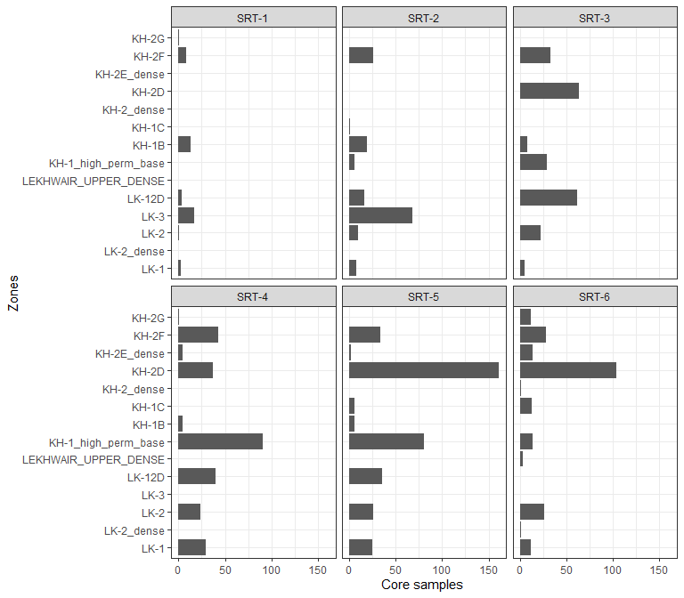
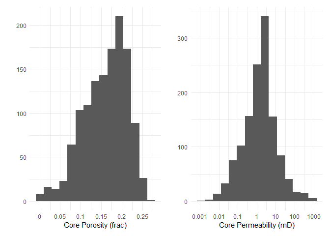
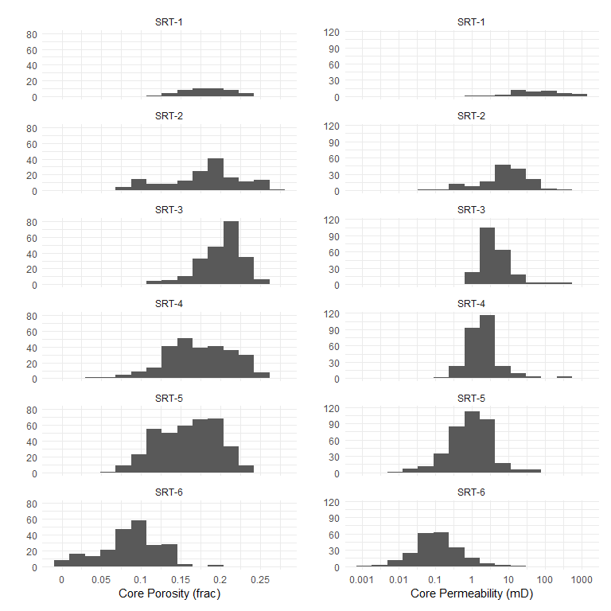
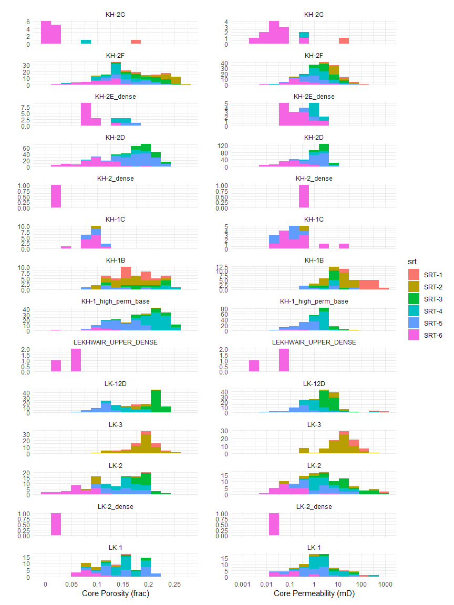
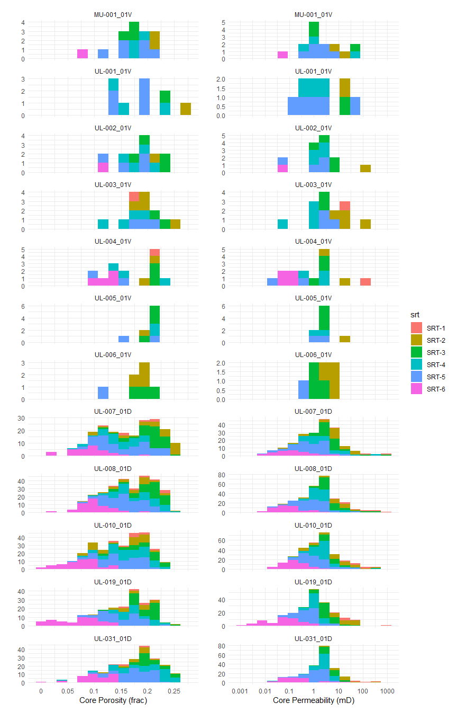
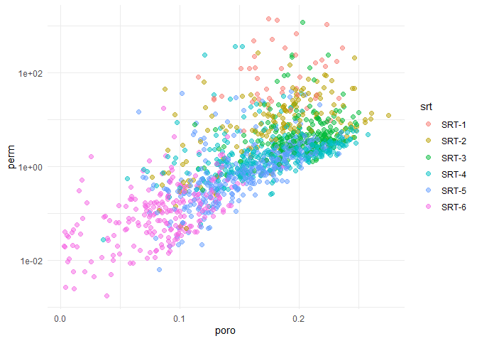
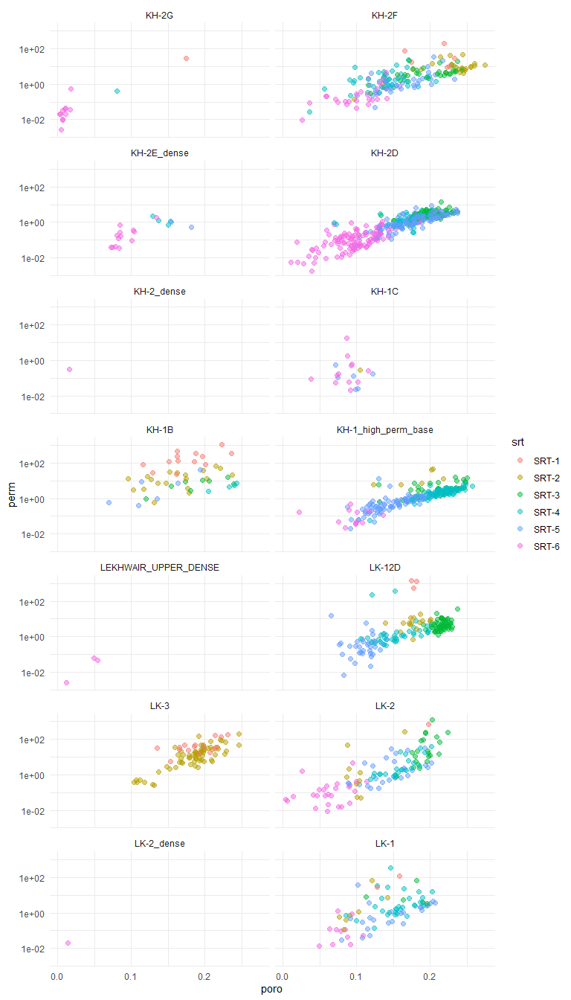

Core data
================

## The data

In this document we load the core data available in Umm lulu :

-   Core samples have been QC and clean up (Colin 2018 project, and a
    similar approach has been performed on newer samples).

-   Depth shift interpretation performed by Cepsa, the OPCO official
    values have not been received.

-   Log values have been sampled at each sample.

The available data will be loaded and analysed in this document

## Samples per well

There are a total of 13 wells with core samples and 1703 samples,
however for this study we only use the samples with SRT interpretation
the following table shows the available samples per well

## Samples per zone

Its clear from the table below that the main reservoirs have the largest
amount of samples:

The same information visually:

<!-- -->

## Samples per SRT

A quick view to the table reveals that the SRT-1 and SRT-2 have
significatevely less samples than the rest of the SRTs.

### Visually :

<!-- -->

A different view by SRT shows clearly the zones with larger
representation of samples per SRT.

<!-- -->

## Porosity - Permeability data QC

Porosity and permeability are presented in histograms.

<!-- -->

A split by SRT allow us to understand the variability in rock quality as
we move trough the SRTs.

<!-- -->

### histograms by zone

A similar analysis, this time by zone and using the color attribute to
visualize the SRTs.

<!-- -->

### histograms by well

<!-- -->

### poro perm cross plot

<!-- -->

# cross plot by zone

<!-- -->
